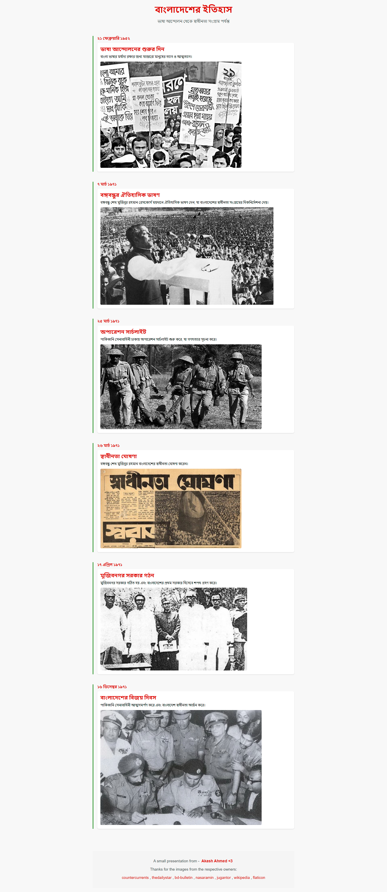

# বাংলাদেশ ইতিহাস Timeline

A timeline showcasing key events in Bangladesh's history, from the Language Movement to the Liberation War.

## Screenshot

## Features

- **Responsive Design:** Optimized for mobile, tablet, and desktop devices.
- **Interactive Timeline:** Displays key historical events with images and descriptions.
- **Custom Font Loader:** Implements a loader until the custom Bengali font is fully loaded.

## Technologies Used

- **React (Next.js):** For building interactive, component-based UIs.
- **Styled JSX & CSS:** For scoped styling and responsive layouts.
- **Font Loading API:** For smooth loading of the NotoSansBengali font.